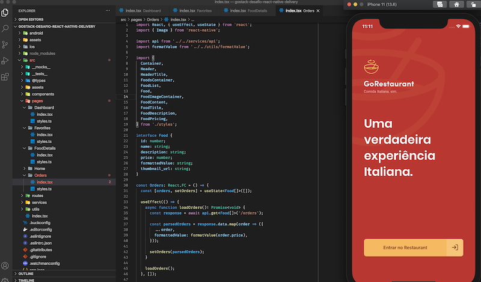

# gostack-desafio-react-native-delivery

Este repositório representa a implementação e/ou resolução do [Desafio 11: GoRestaurant Mobile](https://github.com/Rocketseat/bootcamp-gostack-desafios/tree/master/desafio-react-native-delivery, treinamento [GoStack Bootcamp](https://rocketseat.com.br/gostack) da [RocketSeat](https://rocketseat.com.br).

Amostra:



> As palavras-chave "DEVE", "NÃO DEVE", "REQUER", "DEVERIA", "NÃO DEVERIA", "PODERIA", "NÃO PODERIA", "RECOMENDÁVEL", "PODE", e "OPCIONAL" neste documento devem ser interpretadas como descritas no [RFC 2119](http://tools.ietf.org/html/rfc2119). Tradução livre [RFC 2119 pt-br](http://rfc.pt.webiwg.org/rfc2119).

## Requisitos

As versões citadas abaixo são sugeridas, não um pré-requisito:

- Nodejs >= 12.13.1
- Yarn >= 1.22.0

## Obtendo os fontes

> Você PODE realizar o clone deste repositório ou baixar o arquivo zip.

Clone este repositório:
```
git clone https://github.com/fabiojaniolima/gostack-desafio-reactjs-crud.git
```

Para baixar o zip: https://github.com/fabiojaniolima/gostack-desafio-reactjs-crud/archive/master.zip

## :arrow_forward: Executando o projeto

Na raiz do projeto você DEVE executar a instrução:
```
yarn
```

Para iniciar a API fake execute:
```
yarn json-server server.json -p 3333
```

Para rodar o projeto em desenvolvimento você PODE executar:
```
yarn start
```

## :white_check_mark: Rodando testes

Para executar a suíte de testes você PODE rodar a instrução:
```
yarn test
```

Já para rodar um teste especifico basta informar seu `{describe} {it}`. Exemplo:
```
yarn test -t "Dashboard should be able to list all the food plates from your api"
```

> A instrução acima realiza a execução de todos os testes que casarem com o **matching** informado.

## :memo: Licença

Esse projeto está sob a licença MIT. Veja o arquivo [LICENSE](LICENSE) para mais detalhes.
